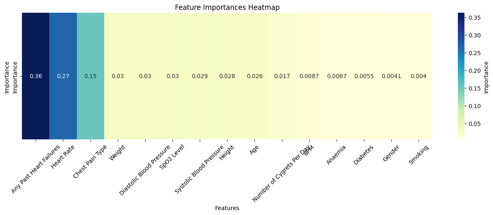
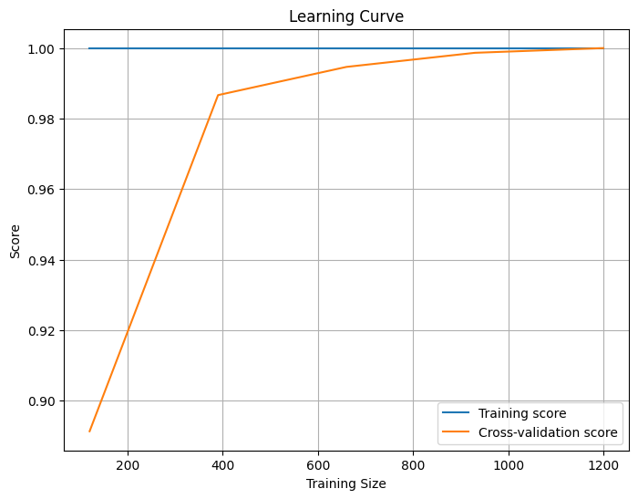
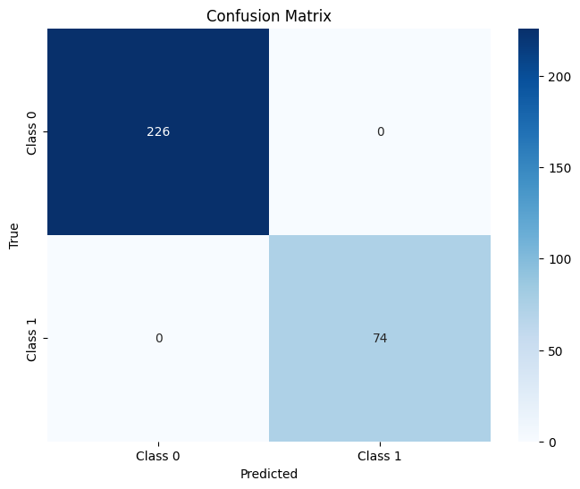
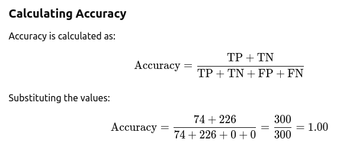
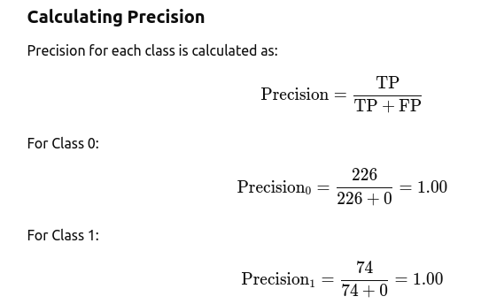
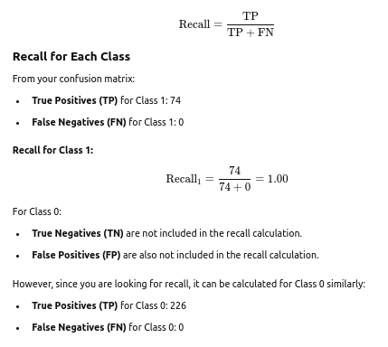
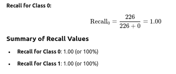

# Accuracy Metrics: 
## Feature Importance Heatmap
A feature importance heatmap visually represents the relative importance of each feature in a machine learning model, helping to identify which features contribute most to the model's predictions. This insight can guide feature selection, model interpretation, and subsequent improvements in model performance.

## Learning Curve

## Confusion Metrix

This indicates:
1. True Negatives (TN): 226 (predicted 0 and actually 0)
2. False Positives (FP): 0 (predicted 1 but actually 0)
3. False Negatives (FN): 0 (predicted 0 but actually 1)
4. True Positives (TP): 74 (predicted 1 and actually 1)

## Accuracy Calculations

## Precision Calculations

## Recall Calculations

# Summary
1. Model Accuracy: 1.00 (or 100%)
2. Precision for Class 0: 1.00 (or 100%)
3. Precision for Class 1: 1.00 (or 100%)
Overall, Model shows perfect accuracy and precision for both classes, indicating that it has correctly classified all instances in the test set!